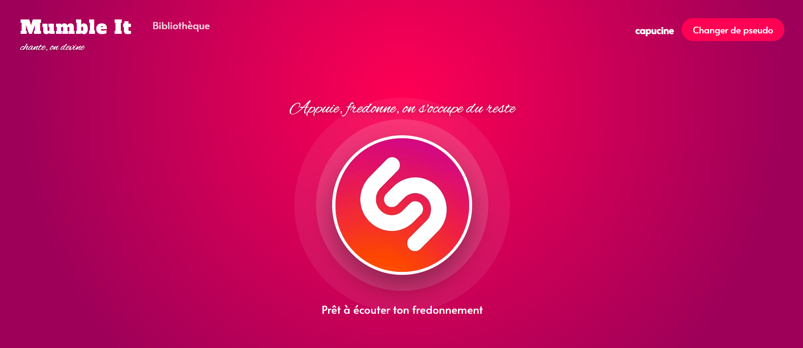
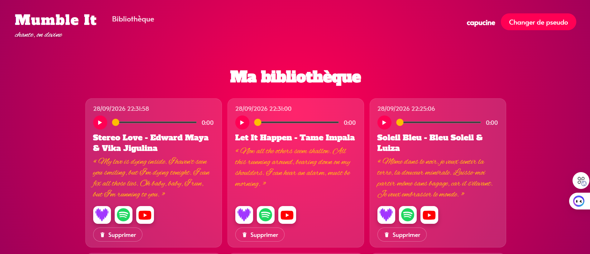

# Mumble It

Tu as un son en tête, mais ni les paroles exactes ni le titre ? **Chante ou fredonne comme tu peux**, Mumble It transcrit ta voix, envoie ça à une IA qui devine le titre et l'artiste, et te renvoie directement le lien pour écouter le vrai morceau sur Deezer ou YouTube.

## Fonctionnalités

- **Enregistrement vocal** directement depuis le navigateur, en appuyant sur le gros logo au centre de l'écran
- **Réécoute et gestion** de ses fredonnements (bibliothèque personnelle, suppression)
- **Analyse IA** via Groq : transcription (Whisper), puis devinette titre + artiste **ancrée sur une recherche web** (Tavily) en priorité, avec repli sur le LLM seul si le web est indisponible
- **Réponse honnête** : "Inconnu" plutôt qu'un titre inventé si rien n'est identifié avec certitude
- **Liens d'écoute automatiques** vers Deezer (API publique) et recherche YouTube
- **Pseudo factice** (pas de vraie authentification) pour retrouver ses propres fredonnements

## Lancer le projet

### 1. Prérequis
- Python 3.10+
- Une clé API [Groq](https://console.groq.com/)
- (Optionnel mais recommandé) Une clé API [Tavily](https://tavily.com) pour activer la recherche web lors de la devinette

### 2. Installation
```bash
python -m venv .venv
.venv\Scripts\activate        # Windows
pip install -r requirements.txt
```

### 3. Configuration
Copier `.env.example` en `.env` et renseigner tes clés :
```
GROQ_API_KEY=ta_cle_groq_ici
TAVILY_API_KEY=ta_cle_tavily_ici
ENABLE_WEB_FALLBACK=true
```
- `TAVILY_API_KEY` optionnelle (sans elle : devinette LLM seule) ; `ENABLE_WEB_FALLBACK` (`true`/`false`) active la recherche web en priorité (défaut `true`).

### 4. Démarrage
```bash
python -m uvicorn main:app --reload --port 8001
```
L'application est accessible sur `http://127.0.0.1:8001`.

## Choix techniques

- **Backend minimal** : FastAPI + accès SQLite direct (pas d'ORM), pour rester simple et lisible
- **Frontend sans framework** : HTML/Jinja2 + JS vanilla, découpé par responsabilité (`recorder.js`, `analysis.js`, `library.js`, `api.js`...)
- **Secrets hors code** : clés Groq/Tavily via `python-dotenv`, `.env` ignoré par git
- **Sécurité par défaut** : requêtes SQL paramétrées, actions d'écriture en POST/DELETE uniquement, timeouts sur tous les appels externes (Groq, Tavily, Deezer)
- **Analyse asynchrone** : lancée en tâche de fond (`BackgroundTasks`) pour ne pas bloquer l'upload
- **Recherche web en priorité** sur le LLM seul, car ce dernier peut halluciner un titre plausible sans jamais dire "Inconnu"

## Architecture

```
main.py, config.py, database.py    → app FastAPI, config, connexion/schéma SQLite
dependencies.py, models.py         → pseudo courant (login factice), schémas Pydantic
serializers.py                     → conversion lignes SQLite → modèles

routers/
  pages.py          → pages HTML (accueil, bibliothèque)
  recordings.py     → CRUD des enregistrements audio
  analysis.py       → déclenchement de l'analyse IA

services/
  groq_client.py       → Groq (transcription Whisper + devinette LLM) et Tavily (recherche web)
  deezer_client.py     → recherche du morceau sur Deezer
  analysis_service.py  → orchestration du pipeline ci-dessous

static/, templates/    → JS/CSS vanilla, pages Jinja2
data/                  → base SQLite + fichiers audio uploadés
```

**Pipeline d'analyse** (`analysis_service.run_analysis`, en tâche de fond) :
`Whisper (transcription)` → `Tavily (recherche web des paroles, si activée)` → `Groq Chat (devinette ancrée sur le web, ou LLM seul en repli)` → `Deezer (lien d'écoute, sauf si "Inconnu")` → mise à jour en base, consultable via `GET /recordings/{id}`.

## Aperçu

| Accueil | Bibliothèque |
|---|---|
|  |  |
